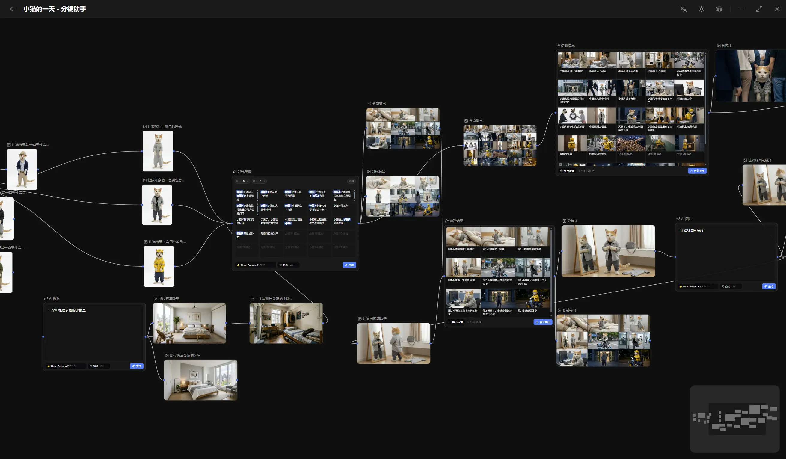

<div align="center">
  
  <h1 style="color: ##111227;">镜绘大师</h1>
  <h3>FrameCraft Pro - 基于节点画布的 AI 分镜工作台，一站式完成图片生成、编辑与分镜流程</h3>

  [](https://github.com/lorryjovens-hub/FrameCraft-Pro/stargazers)
  [](https://github.com/lorryjovens-hub/FrameCraft-Pro/network/members)
  [](https://github.com/lorryjovens-hub/FrameCraft-Pro/blob/main/LICENSE)
</div>

<div align="center">
  
</div>

## ✨ 简介

**镜绘大师 FrameCraft Pro** 是一款功能强大的 AI 分镜创作工具，基于节点画布设计，让创意工作者能够轻松完成从产品图片到专业分镜的全流程创作。

### 🎯 核心功能

- 🖼️ **多角度渲染** - 上传产品图，AI 自动生成多角度渲染效果
- 🎬 **高质量产品摄影** - 一键生成专业级产品摄影图片
- 💡 **智能光影调整** - 灵活调整打光角度和颜色，打造理想光影效果
- 🎥 **分镜生成** - 输入提示词即可生成高质量视频分镜
- 🎬 **视频合成** - 支持 Seedance 2.0、King Q、Video 3.1 等顶级视频模型
- 👤 **人脸合规检测** - 智能检测人脸，确保内容合规
- 🔗 **主体一致性** - 上传主体信息，AI 自动保持跨镜头一致性

### 📦 内置工具

- **裁剪工具** - 精准裁剪构图
- **标注工具** - 分镜标注与注释
- **宫格切分** - 分镜一键切分预览
- **批量处理** - 素材批量处理

### 🎨 丰富风格库

电商场景 | 风格渲染 | 平面设计 | 创意艺术 | 专业摄影
30+ 预设风格，持续更新

## 下载

<div align="center">
Windows 用户请下载 <strong>.exe</strong> 文件，macOS 用户请下载 <strong>.dmg</strong> 文件

Windows 用户如果在启动时遇到了报错，请尝试安装 [WebView2 运行时](https://developer.microsoft.com/zh-cn/Microsoft-edge/webview2#download)

### Github 下载
[](https://github.com/lorryjovens-hub/FrameCraft-Pro/releases/latest)

</div>

## 🚀 快速开始

### 环境要求

- Node.js 20+
- npm 10+
- Rust stable（含 Cargo）
- Tauri 平台依赖

### 安装

```bash
# 克隆项目
git clone https://github.com/lorryjovens-hub/FrameCraft-Pro.git

# 进入目录
cd FrameCraft-Pro

# 安装依赖
npm install
```

### 运行

**仅前端开发：**
```bash
npm run dev
```

**Tauri 联调（推荐）：**
```bash
npm run tauri dev
```

### 构建

**前端构建：**
```bash
npm run build
```

**桌面应用打包：**
```bash
npm run tauri build
```

## 🛠️ 技术栈

| 层级 | 技术 |
|------|------|
| 前端框架 | React 18 + TypeScript |
| 状态管理 | Zustand |
| 画布引擎 | @xyflow/react |
| 样式方案 | TailwindCSS |
| 桌面容器 | Tauri 2 |
| 后端语言 | Rust |
| 数据存储 | SQLite (rusqlite, WAL) |
| 国际化 | react-i18next |

## 📁 项目结构

```
FrameCraft-Pro/
├── src/
│   ├── components/          # 通用 UI 组件
│   ├── features/            # 功能模块
│   │   └── canvas/         # 画布核心功能
│   │       ├── nodes/       # 节点组件
│   │       ├── tools/       # 工具插件
│   │       ├── models/      # AI 模型
│   │       └── comfyui/     # ComfyUI 集成
│   ├── stores/              # 状态管理
│   ├── commands/            # Tauri 命令
│   └── i18n/                 # 国际化
├── src-tauri/               # Rust 后端
├── docs/                    # 文档
└── scripts/                 # 构建脚本
```

## 🤝 贡献

欢迎提交 Issue 和 Pull Request！

## 📄 开源协议

本项目基于 [MIT License](LICENSE) 开源。

## 🙏 致谢

- [ComfyUI](https://github.com/comfyanonymous/ComfyUI) - 强大的 AI 图像生成框架
- [Tauri](https://tauri.app/) - 轻量级桌面应用框架
- [xyflow](https://xyflow.com/) - 流程图/节点画布库

---

<div align="center">
  <sub>Made with ❤️ by <a href="https://github.com/lorryjovens-hub">lorryjovens</a></sub>
</div>
